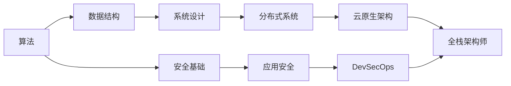

<!-- ═══════════════════════════════════════════════════════════════════ -->
<!--                          顶部横幅                                  -->
<!-- ═══════════════════════════════════════════════════════════════════ -->

<div align="center">


<p>
  
</p>

<p>
  <a href="https://github.com/yuanshikai168"></a>
  <a href="mailto:hello@example.com"></a>
  <a href="https://twitter.com/yourhandle"></a>
  <a href="https://linkedin.com/in/yourprofile"></a>
</p>

<p>
  
  
  
  
</p>

</div>

<br/>

<!-- ═══════════════════════════════════════════════════════════════════ -->
<!--                          启动序列                                  -->
<!-- ═══════════════════════════════════════════════════════════════════ -->

```
 ██╗  ██╗███████╗██╗   ██╗██████╗ ██╗   ██╗
 ██║  ██║██╔════╝██║   ██║██╔══██╗██║   ██║
 ███████║█████╗  ██║   ██║██████╔╝███████║
 ██╔══██║██╔══╝  ╚██╗ ██╔╝██╔══██╗██╔══██║
 ██║  ██║███████╗ ╚████╔╝ ██████╔╝██║  ██║
 ╚═╝  ╚═╝╚══════╝  ╚═══╝  ╚═════╝ ╚═╝  ╚═╝
```

```
╔══════════════════════════════════════════════════════════════════════════════╗
║  系统启动中...                                                              ║
╠══════════════════════════════════════════════════════════════════════════════╣
║                                                                              ║
║  自检 BIOS  ──────  正常                                                     ║
║  内存检测  ──────  128 GB ECC DDR5  ──────  正常                            ║
║  处理器    ──────  全栈引擎 v3.0  ──────  正常                               ║
║  安全模块  ──────  防火墙已启用 / 入侵检测已启用  ──────  正常                ║
║  网络协议  ──────  云原生技术栈已加载  ──────  正常                          ║
║  咖啡因    ──────  ☕☕☕☕☕ 无限续杯  ──────  严重依赖                       ║
║                                                                              ║
║  [███████████████████████████████████████████████████████] 100%               ║
║                                                                              ║
║  系统就绪，正在加载个人档案...                                                ║
║                                                                              ║
║  yuanshikai168@github:~$  _                                                  ║
╚══════════════════════════════════════════════════════════════════════════════╝
```

<br/>

<!-- ═══════════════════════════════════════════════════════════════════ -->
<!--                        终端导航                                    -->
<!-- ═══════════════════════════════════════════════════════════════════ -->

```
╔══════════════════════════════════════════════════════════════════════════════╗
║  ~/profile $  ls -la                                                         ║
╠══════════════════════════════════════════════════════════════════════════════╣
║                                                                              ║
║  drwxr-xr-x  🎯 about/         个人简介与仪表盘                             ║
║  drwxr-xr-x  🛠️  skills/        技术栈与熟练度                               ║
║  drwxr-xr-x  📂 projects/      精选项目与仓库                               ║
║  drwxr-xr-x  🏆 awards/        认证与荣誉                                   ║
║  drwxr-xr-x  🔥 now/           当前正在做                                   ║
║  drwxr-xr-x  🚀 quickstart/    快速上手指南                                 ║
║  drwxr-xr-x  💻 code/          代码片段示例                                 ║
║  drwxr-xr-x  📊 stats/         GitHub 数据分析                              ║
║  drwxr-xr-x  📝 blog/          近期文章                                     ║
║  drwxr-xr-x  🖥️  setup/         开发环境配置                                 ║
║  drwxr-xr-x  🤝 contribute/    协作指南                                     ║
║  drwxr-xr-x  📬 contact/       联系方式                                     ║
║                                                                              ║
║  ~/profile $  _                                                              ║
╚══════════════════════════════════════════════════════════════════════════════╝
```

<br/>

<!-- ═══════════════════════════════════════════════════════════════════ -->
<!--                        关于我                                      -->
<!-- ═══════════════════════════════════════════════════════════════════ -->

<div align="center">


</div>

<table>
<tr>
<td width="48%" valign="top">

#### `systemctl status yuanshikai168`

```diff
● yuanshikai168.service — 全栈工程师 & 安全架构师
     加载路径: loaded (/etc/passion/fullstack.conf)
     运行状态: active (running) 自 2020 年起
     内存占用: 无上限 (咖啡驱动)

+ 当前任务:
+   🏗️  构建高韧性分布式系统
+   🔐  将安全融入软件开发生命周期
+   ☁️  设计云原生解决方案
+   📖  参与开源社区贡献
+   🎓  研究系统设计与算法优化

! 待升级技能:
!   Rust 系统编程
!   eBPF 内核级可观测性
!   零信任安全架构
```

</td>
<td width="52%" valign="top">

#### `cat ~/.config/identity.yml`

```yaml
# ═══════════════════════════════════════════
#  个人配置档案
# ═══════════════════════════════════════════

身份:
  用户名:  yuanshikai168
  角色:    全栈工程师
  别名:    安全架构师
  坐标:    中国
  学历:    计算机科学

环境:
  专注领域:  [分布式, 安全, 云原生]
  能量来源:  coffee://无限续杯
  编辑器:    [VS Code, Neovim]
  操作系统:  [Linux, macOS]
  终端:      zsh + tmux
  主题:      Tokyo Night

专业领域:
  可以问我:
    - 微服务架构设计
    - 应用安全加固
    - CI/CD 流水线工程
    - 云原生迁移策略
```

</td>
</tr>
</table>

> ```
> ┌─ 工程哲学 ─────────────────────────────────────────────────────────────┐
> │                                                                        │
> │  "安全不是附加功能，而是设计基因。"                                      │
> │                                                                        │
> │  优秀工程 = 整洁设计                                                    │
> │            + 严谨安全                                                   │
> │            + 可靠运维                                                   │
> │                                                                        │
> └────────────────────────────────────────────────────────────────────────┘
> ```

<br/>

<!-- ═══════════════════════════════════════════════════════════════════ -->
<!--                        技术栈                                      -->
<!-- ═══════════════════════════════════════════════════════════════════ -->

<div align="center">


</div>

#### `>` 编程语言

<p align="center">
  
  
  
  
  
  
  
  
</p>

#### `>` 框架与运行时

<p align="center">
  
  
  
  
  
  
  
  
</p>

#### `>` 数据与基础设施

<p align="center">
  
  
  
  
</p>

<p align="center">
  
  
  
  
</p>

<p align="center">
  
  
  
</p>

#### `>` 安全与可观测性

<p align="center">
  
  
  
  
  
  
</p>

#### `>` 熟练度扫描

```
╔══════════════════════════════════════════════════════════════════════════════╗
║  技能熟练度矩阵                                                              ║
╠══════════════════════════════════════════════════════════════════════════════╣
║                                                                              ║
║  Python       ████████████████████░░░░░░░░░░  95%  ██████  专家             ║
║  JavaScript   ███████████████████░░░░░░░░░░░  90%  ██████  专家             ║
║  SQL          ███████████████████░░░░░░░░░░░  90%  ██████  专家             ║
║  TypeScript   ██████████████████░░░░░░░░░░░░  85%  █████░  高级             ║
║  Golang       ████████████████░░░░░░░░░░░░░░  80%  █████░  高级             ║
║  Shell        ██████████████░░░░░░░░░░░░░░░░  70%  ████░░  熟练             ║
║  Java         █████████████░░░░░░░░░░░░░░░░░  65%  ████░░  熟练             ║
║  Rust         ██████████░░░░░░░░░░░░░░░░░░░░  50%  ███░░░  中级             ║
║                                                                              ║
╚══════════════════════════════════════════════════════════════════════════════╝
```

#### `>` 编码活跃度

```
╔══════════════════════════════════════════════════════════════════════════════╗
║  本周编码统计                                                                ║
╠══════════════════════════════════════════════════════════════════════════════╣
║                                                                              ║
║  Python     ████████████████████  52.3%   18小时24分                        ║
║  TypeScript █████████████░░░░░░░  24.1%    8小时30分                        ║
║  Go         ████████░░░░░░░░░░░░  12.7%    4小时28分                        ║
║  Shell      ███░░░░░░░░░░░░░░░░░   5.8%    2小时02分                        ║
║  其他       ██░░░░░░░░░░░░░░░░░░   5.1%    1小时47分                        ║
║                                                                              ║
║  总计: 35小时11分，本周共142次提交                                           ║
╚══════════════════════════════════════════════════════════════════════════════╝
```

<br/>

<!-- ═══════════════════════════════════════════════════════════════════ -->
<!--                        精选项目                                    -->
<!-- ═══════════════════════════════════════════════════════════════════ -->

<div align="center">


</div>

<table>
  <tr>
    <td width="50%" valign="top">

```
╔══════════════════════════════════════════════════╗
║  🏗️ 微服务精选                         [活跃中]  ║
╠══════════════════════════════════════════════════╣
║                                                  ║
║  ▸ 服务发现与负载均衡                             ║
║  ▸ 熔断器与分布式链路追踪                         ║
║  ▸ Docker Compose 一键部署                        ║
║                                                  ║
║  ┌─ 技术栈 ─────────────────────────────────┐   ║
║  │  [Go] [Docker] [K8s] [gRPC]               │   ║
║  └───────────────────────────────────────────┘   ║
║                                                  ║
║  ⭐ 2.4k   🍴 380   📅 2天前更新                 ║
║  >>> github.com/yuanshikai168/project1           ║
╚══════════════════════════════════════════════════╝
```

</td>
    <td width="50%" valign="top">

```
╔══════════════════════════════════════════════════╗
║  🔐 安全API                            [活跃中]  ║
╠══════════════════════════════════════════════════╣
║                                                  ║
║  ▸ JWT + RBAC 认证授权体系                        ║
║  ▸ 速率限制与输入验证                             ║
║  ▸ 自动化安全审计 & OWASP 合规                    ║
║                                                  ║
║  ┌─ 技术栈 ─────────────────────────────────┐   ║
║  │  [Python] [FastAPI] [Redis] [JWT]          │   ║
║  └───────────────────────────────────────────┘   ║
║                                                  ║
║  ⭐ 1.8k   🍴 220   📅 5天前更新                 ║
║  >>> github.com/yuanshikai168/project2           ║
╚══════════════════════════════════════════════════╝
```

</td>
  </tr>
  <tr>
    <td width="50%" valign="top">

```
╔══════════════════════════════════════════════════╗
║  ☁️ DevOps自动化                       [活跃中]  ║
╠══════════════════════════════════════════════════╣
║                                                  ║
║  ▸ 一键部署 AWS/Azure 多区域环境                  ║
║  ▸ 完整 CI/CD 流水线模板库                        ║
║  ▸ 监控告警与成本优化                             ║
║                                                  ║
║  ┌─ 技术栈 ─────────────────────────────────┐   ║
║  │  [Terraform] [AWS] [GH Actions] [K8s]      │   ║
║  └───────────────────────────────────────────┘   ║
║                                                  ║
║  ⭐ 3.1k   🍴 510   📅 今天更新                  ║
║  >>> github.com/yuanshikai168/project3           ║
╚══════════════════════════════════════════════════╝
```

</td>
    <td width="50%" valign="top">

```
╔══════════════════════════════════════════════════╗
║  📊 数据管道                           [测试中]  ║
╠══════════════════════════════════════════════════╣
║                                                  ║
║  ▸ Kafka 流式计算 + Spark 批处理                  ║
║  ▸ 自动化 ETL 与数据质量校验                      ║
║  ▸ Grafana 实时监控看板                           ║
║                                                  ║
║  ┌─ 技术栈 ─────────────────────────────────┐   ║
║  │  [Python] [Kafka] [Spark] [Grafana]        │   ║
║  └───────────────────────────────────────────┘   ║
║                                                  ║
║  ⭐ 960    🍴 130   📅 1周前更新                  ║
║  >>> github.com/yuanshikai168/project4           ║
╚══════════════════════════════════════════════════╝
```

</td>
  </tr>
</table>

<details>
<summary><b>📚 学习路线图与研究笔记</b></summary>



| 领域 | 内容 | 状态 |
|:---|:---|:---:|
| 🧮 算法 | LeetCode 300+ 题详解 | ✅ 进行中 |
| 🏛️ 系统设计 | CAP / Paxos / Raft 案例分析 | ✅ 进行中 |
| 🔍 安全研究 | CVE 复现与 Web 渗透测试 | 🔄 进行中 |
| ⚙️ DevOps | CI/CD · IaC · SRE 实践 | 📝 计划中 |
| 🦀 Rust | 从零到高性能并发编程 | 🌱 起步中 |

</details>

<br/>

<!-- ═══════════════════════════════════════════════════════════════════ -->
<!--                        认证与荣誉                                  -->
<!-- ═══════════════════════════════════════════════════════════════════ -->

<div align="center">


</div>

```
╔══════════════════════════════════════════════════════════════════════════════╗
║  认证与荣誉                                                                  ║
╠══════════════════════════════════════════════════════════════════════════════╣
║                                                                              ║
║  [通过]  ☁️  AWS 解决方案架构师 — Professional    已验证 ✓                    ║
║  [通过]  ☸️  Kubernetes CKAD                      已验证 ✓                    ║
║  [通过]  🐳  Docker 认证工程师 (DCA)               已验证 ✓                    ║
║  [备考]  🛡️  CEH (认证道德黑客)                    备考中                      ║
║  [荣誉]  ⭐  GitHub Star 贡献者 — 10+ 项目         已授予                      ║
║  [获奖]  🏅  黑客松冠军 — 2025 云计算               第一名 🏆                  ║
║                                                                              ║
╚══════════════════════════════════════════════════════════════════════════════╝
```

<br/>

<!-- ═══════════════════════════════════════════════════════════════════ -->
<!--                        当前动态                                    -->
<!-- ═══════════════════════════════════════════════════════════════════ -->

<div align="center">


</div>

```
╔══════════════════════════════════════════════════════════════════════════════╗
║  正在做的事情                                                                ║
╠══════════════════════════════════════════════════════════════════════════════╣
║                                                                              ║
║  🔥  用 Rust 构建基础设施自动化 CLI 工具                                     ║
║      进度: [████████████████░░░░] 80%                                         ║
║                                                                              ║
║  📖  撰写: 《eBPF 云原生应用可观测性实战》                                    ║
║      进度: [██████░░░░░░░░░░░░░] 40%                                         ║
║                                                                              ║
║  🎯  备考 CKA (Kubernetes 认证管理员)                                        ║
║      进度: [█████████████░░░░░░] 90%                                         ║
║                                                                              ║
║  🦀  学习 Rust — 正在阅读《Rust 程序设计语言》第 18 章                       ║
║      进度: [█████████░░░░░░░░░░] 55%                                         ║
║                                                                              ║
╠══════════════════════════════════════════════════════════════════════════════╣
║                                                                              ║
║  🎵  正在播放:                                                               ║
║      Spotify — Bohemian Rhapsody — Queen                                     ║
║      ░░░░░░░░░░░░░░▓▓▓▓▓▓▓▓▓▓░░░░░░░░░░░░░░░░░░░░░░░░░  2:34 / 5:55        ║
║                                                                              ║
╚══════════════════════════════════════════════════════════════════════════════╝
```

<!-- Spotify 动态组件需要配置 Novatorem 服务，暂时移除
<p align="center">
  <a href="https://open.spotify.com/user/youruser">
    
  </a>
</p>
-->

<br/>

<!-- ═══════════════════════════════════════════════════════════════════ -->
<!--                        快速上手                                    -->
<!-- ═══════════════════════════════════════════════════════════════════ -->

<div align="center">


</div>

#### `>` 前置条件

```
╔══════════════════════════════════════════════════════════════════════════════╗
║  环境要求                                                                    ║
╠══════════════════╦══════════════╦════════════════════════════════════════════╣
║  工具            ║  版本        ║  用途                                      ║
╠══════════════════╬══════════════╬════════════════════════════════════════════╣
║  Python          ║  >= 3.10     ║  后端运行时                                ║
║  Node.js         ║  >= 18.0     ║  前端运行时                                ║
║  Docker          ║  >= 24.0     ║  容器化 (可选)                             ║
║  Go              ║  >= 1.21     ║  Go 编译 (可选)                            ║
╚══════════════════╩══════════════╩════════════════════════════════════════════╝
```

#### `>` 克隆与启动

```bash
# ─── Clone ────────────────────────────────────
git clone https://github.com/yuanshikai168/yuanshikai168.git
cd yuanshikai168

# ─── Launch ───────────────────────────────────
# Linux / macOS
chmod +x start.sh && ./start.sh

# Windows (PowerShell / Git Bash)
bash start.sh
```

<details>
<summary><b>📦 手动安装</b></summary>

```bash
# ── Python ──
pip install -r requirements.txt
python app.py

# ── Node.js ──
npm install
npm start

# ── Go ──
go mod download
go run main.go
```

</details>

<details>
<summary><b>🐳 Docker</b></summary>

```bash
docker build -t yuanshikai168 .
docker run -d -p 8000:8000 --name app yuanshikai168

# docker-compose (with DB + cache)
docker-compose up -d
```

</details>

<details>
<summary><b>🧪 测试</b></summary>

```bash
pytest tests/ -v --cov=src --cov-report=html   # Python
npm test -- --coverage                           # JS/TS
./start.sh test                                  # Via script
```

</details>

<details>
<summary><b>📋 start.sh 命令一览</b></summary>

```
╔════════════════════════════╦═════════════════════════════════════════════════╗
║  命令                      ║  说明                                           ║
╠════════════════════════════╬═════════════════════════════════════════════════╣
║  ./start.sh                ║  自动检测并启动 (默认)                          ║
║  ./start.sh deps           ║  仅安装依赖                                     ║
║  ./start.sh docker         ║  启动 Docker 容器                               ║
║  ./start.sh migrate        ║  执行数据库迁移                                 ║
║  ./start.sh test           ║  运行测试套件                                   ║
║  ./start.sh clean          ║  清理缓存与临时文件                             ║
║  ./start.sh help           ║  显示帮助                                       ║
╚════════════════════════════╩═════════════════════════════════════════════════╝
```

</details>

#### `>` 仓库结构

```
yuanshikai168/
├── .github/workflows/
│   └── ci.yml                # CI/CD 流水线配置
├── assets/                   # 静态资源
├── CONTRIBUTING.md           # 贡献指南
├── README.md                 # 你正在看的文件 ✨
├── package.json-example      # Node.js 依赖示例
├── requirements-example.txt  # Python 依赖示例
└── start.sh                  # 一键启动脚本
```

<br/>

<!-- ═══════════════════════════════════════════════════════════════════ -->
<!--                        代码示例                                    -->
<!-- ═══════════════════════════════════════════════════════════════════ -->

<div align="center">


</div>

<details>
<summary><b>🐍 Python — 异步 API（FastAPI + 连接池）</b></summary>

```python
from fastapi import FastAPI, Depends, HTTPException, status
from fastapi.security import HTTPBearer
from contextlib import asynccontextmanager
from sqlalchemy.ext.asyncio import create_async_engine

engine = create_async_engine("postgresql+asyncpg://localhost/app", pool_size=20)

@asynccontextmanager
async def lifespan(app: FastAPI):
    await init_db_pool(engine)
    await init_redis_cache("redis://localhost:6379")
    yield
    await engine.dispose()

app = FastAPI(title="Secure API", version="1.0.0", lifespan=lifespan)
security = HTTPBearer()

@app.get("/api/v1/data")
async def get_data(credentials=Depends(security)):
    try:
        result = await fetch_from_db(engine)
        return {"status": "success", "data": result, "count": len(result)}
    except Exception as e:
        raise HTTPException(
            status_code=status.HTTP_500_INTERNAL_SERVER_ERROR,
            detail=str(e),
        )
```

</details>

<details>
<summary><b>⚛️ React — 仪表盘（Hooks + 错误边界）</b></summary>

```jsx
import React, { useState, useEffect, useCallback } from 'react';
import axios from 'axios';

export const Dashboard = () => {
  const [data, setData] = useState([]);
  const [loading, setLoading] = useState(true);
  const [error, setError] = useState(null);

  const fetchData = useCallback(async () => {
    setLoading(true);
    setError(null);
    try {
      const { data: res } = await axios.get('/api/v1/data', {
        headers: { Authorization: `Bearer ${getToken()}` },
      });
      setData(res.data);
    } catch (err) {
      setError(err.response?.data?.detail ?? 'Load failed');
    } finally {
      setLoading(false);
    }
  }, []);

  useEffect(() => { fetchData(); }, [fetchData]);

  if (loading) return <Skeleton rows={5} />;
  if (error)   return <ErrorAlert message={error} onRetry={fetchData} />;

  return (
    <section className="dashboard">
      <h2>Dashboard</h2>
      <ul className="card-grid">
        {data.map(item => (
          <li key={item.id} className="card">{item.name}</li>
        ))}
      </ul>
    </section>
  );
};
```

</details>

<details>
<summary><b>🔵 Go — 并发 HTTP 请求器（Worker Pool 模式）</b></summary>

```go
package main

import (
    "fmt"
    "net/http"
    "sync"
    "time"
)

func FetchConcurrently(urls []string, workers int) map[string]string {
    results := make(map[string]string)
    var mu sync.Mutex
    var wg sync.WaitGroup
    sem := make(chan struct{}, workers)
    client := &http.Client{Timeout: 5 * time.Second}

    for _, url := range urls {
        wg.Add(1)
        go func(u string) {
            defer wg.Done()
            sem <- struct{}{}
            defer func() { <-sem }()

            resp, err := client.Get(u)
            if err == nil {
                defer resp.Body.Close()
                mu.Lock()
                results[u] = resp.Status
                mu.Unlock()
            }
        }(url)
    }
    wg.Wait()
    return results
}

func main() {
    urls := []string{"https://example.com", "https://httpbin.org/get"}
    for url, status := range FetchConcurrently(urls, 5) {
        fmt.Printf("%-30s -> %s\n", url, status)
    }
}
```

</details>

<br/>

<!-- ═══════════════════════════════════════════════════════════════════ -->
<!--                        GitHub 数据                                 -->
<!-- ═══════════════════════════════════════════════════════════════════ -->

<div align="center">


</div>

<p align="center">
  
  
</p>

<p align="center">
  
</p>

<p align="center">
  
</p>

#### `>` 贡献热力图

<p align="center">
  
</p>

#### `>` 近期活动

<p align="center">
  
</p>

<!-- 贪吃蛇动画需要配置 GitHub Action 生成，暂时注释
<p align="center">
  
</p>
-->

<br/>

<!-- ═══════════════════════════════════════════════════════════════════ -->
<!--                        博客文章                                    -->
<!-- ═══════════════════════════════════════════════════════════════════ -->

<div align="center">


</div>

```
╔══════════════════════════════════════════════════════════════════════════════╗
║  最近文章                                                                    ║
╠══════════════════════════════════════════════════════════════════════════════╣
║                                                                              ║
║  📄  [2026-05-18]  用 Go 构建高韧性微服务                                    ║
║       微服务容错与弹性架构实践                                               ║
║       #微服务 #Go #容错 #分布式系统                                          ║
║                                                                              ║
║  📄  [2026-05-05]  零信任架构实战指南                                        ║
║       从理论到落地的完整安全体系                                             ║
║       #安全 #零信任 #架构 #最佳实践                                          ║
║                                                                              ║
║  📄  [2026-04-22]  K8s 成本优化：省下 40% 云账单                             ║
║       Kubernetes 集群资源精细化运营                                          ║
║       #Kubernetes #云原生 #成本优化 #DevOps                                  ║
║                                                                              ║
║  📄  [2026-04-10]  从单体到微服务：迁移实战手册                              ║
║       大规模系统重构的完整路径                                               ║
║       #迁移 #架构 #重构 #案例分析                                            ║
║                                                                              ║
║  >>> 更多文章请访问 blog.yuanshikai168.dev                                   ║
╚══════════════════════════════════════════════════════════════════════════════╝
```

<br/>

<!-- ═══════════════════════════════════════════════════════════════════ -->
<!--                        开发环境                                    -->
<!-- ═══════════════════════════════════════════════════════════════════ -->

<div align="center">


</div>

<table>
<tr>
<td width="50%" valign="top">

#### `neofetch`

```
       _,met$$$$$gg.           yuanshikai168@devstation
    ,g$$$$$$$$$$$$$$$P.       ──────────────────────────
  ,g$$P"     """Y$$.".        系统:     Arch Linux x86_64
 ,$$P'              `$$$.      内核:     6.7.0-zen
',$$P       ,ggs.     `$$b:    终端:     zsh 5.9
`d$$'     ,$P"'   .    $$$     编辑器:   Neovim / VS Code
 $$P      d$'     ,    $$P     模拟器:   Alacritty + tmux
 $$:      $$.   -    ,d$$'     主题:     Tokyo Night
 $$;      Y$b._   _,d$P'       字体:     JetBrains Mono NF
 Y$$.    `.`"Y$$$$P"'          处理器:   AMD Ryzen 9 7950X
 `$$b      "-.__               显卡:     NVIDIA RTX 4090
  `Y$$                         内存:     64 GB DDR5
   `Y$$.                       硬盘:     2 TB NVMe SSD
     `$$b.                     运行:     ∞ (咖啡因驱动)
       `Y$$b.
          `"Y$b._
              `"""
```

</td>
<td width="50%" valign="top">

#### `cat ~/.config/tools.json`

```json
{
  "终端": {
    "模拟器":    "Alacritty",
    "复用器":    "tmux",
    "命令行":    "zsh + starship"
  },
  "编辑器": {
    "主力":      "Neovim + LazyVim",
    "备用":      "VS Code",
    "字体":      "JetBrains Mono NF",
    "主题":      "Tokyo Night"
  },
  "效率工具": {
    "笔记":      "Obsidian",
    "绘图":      "Excalidraw",
    "接口测试":  "HTTPie + Bruno",
    "数据库":    "DBeaver"
  },
  "运维": {
    "持续集成":  "GitHub Actions",
    "基础设施":  "Terraform + Pulumi",
    "监控":      "Grafana Stack",
    "容器":      "Docker + Podman"
  },
  "硬件": {
    "键盘":      "Keychron Q1 Pro",
    "鼠标":      "Logitech MX Master 3S",
    "显示器":    "LG 32UN880 4K"
  }
}
```

</td>
</tr>
</table>

<br/>

<!-- ═══════════════════════════════════════════════════════════════════ -->
<!--                        贡献指南                                    -->
<!-- ═══════════════════════════════════════════════════════════════════ -->

<div align="center">


</div>

```
╔══════════════════════════════════════════════════════════════════════════════╗
║  贡献工作流                                                                  ║
╠══════════════════════════════════════════════════════════════════════════════╣
║                                                                              ║
║  复刻 ──▶ 克隆 ──▶ 分支 ──▶ 编码 ──▶ 测试 ──▶ 提交 ──▶ 推送 ──▶ PR       ║
║                                                                              ║
╠══════════════════════════════════════════════════════════════════════════════╣
║                                                                              ║
║  分支命名:   feature/xxx · fix/xxx · docs/xxx · refactor/xxx                ║
║  提交格式:   约定式提交 (feat/fix/docs/style/refactor/...)                  ║
║  PR 要求:    CI 通过 + 至少 1 个审批 + 覆盖率 >= 80%                        ║
║                                                                              ║
║  完整指南: CONTRIBUTING.md                                                   ║
╚══════════════════════════════════════════════════════════════════════════════╝
```

<br/>

<!-- ═══════════════════════════════════════════════════════════════════ -->
<!--                        CI/CD 流水线                                -->
<!-- ═══════════════════════════════════════════════════════════════════ -->

<div align="center">


</div>

```
  推送 / PR
     │
     ▼
  ╔══════════════╗     ╔══════════════╗     ╔══════════════╗
  ║  🔍 代码检查  ║────▶║  🧪 自动化测试║────▶║  📊 质量分析  ║
  ║ Super-Linter ║     ║ pytest/jest  ║     ║  SonarQube   ║
  ╚══════════════╝     ╚══════════════╝     ╚══════════════╝
                                                  │
                                                  ▼
  ╔══════════════╗     ╔══════════════╗     ╔══════════════╗
  ║  ✅ 发布部署  ║◀────║  🐳 构建镜像  ║◀────║  🛡️ 安全扫描  ║
  ║    正式发布   ║     ║   Docker     ║     ║ Trivy+OWASP  ║
  ╚══════════════╝     ╚══════════════╝     ╚══════════════╝
```

> 配置文件: [.github/workflows/ci.yml](.github/workflows/ci.yml)

<br/>

<!-- ═══════════════════════════════════════════════════════════════════ -->
<!--                        联系我                                      -->
<!-- ═══════════════════════════════════════════════════════════════════ -->

<div align="center">


</div>

```
╔══════════════════════════════════════════════════════════════════════════════╗
║  正在建立连接...                                                             ║
╠══════════════════════════════════════════════════════════════════════════════╣
║                                                                              ║
║  📧  邮箱        hello@example.com                                           ║
║  🐙  GitHub      github.com/yuanshikai168                                    ║
║  💼  LinkedIn    linkedin.com/in/yourprofile                                 ║
║  🐦  Twitter     twitter.com/yourhandle                                      ║
║  🐛  问题反馈    github.com/yuanshikai168/yuanshikai168/issues              ║
║  💬  社区讨论    github.com/yuanshikai168/yuanshikai168/discussions          ║
║                                                                              ║
║  连接已建立，等待输入...                                                     ║
║                                                                              ║
║  yuanshikai168@github:~$  _                                                  ║
╚══════════════════════════════════════════════════════════════════════════════╝
```

<p align="center">
  <a href="mailto:hello@example.com"></a>
  <a href="https://github.com/yuanshikai168"></a>
  <a href="https://linkedin.com/in/yourprofile"></a>
  <a href="https://twitter.com/yourhandle"></a>
</p>

<br/>

<!-- ═══════════════════════════════════════════════════════════════════ -->
<!--                        技术名言                                    -->
<!-- ═══════════════════════════════════════════════════════════════════ -->

<div align="center">

```
╔══════════════════════════════════════════════════════════════════════════════╗
║                                                                              ║
║   "计算机科学只有两件难事：                                                   ║
║    缓存失效和命名。"                                                         ║
║                                                                              ║
║                                            — Phil Karlton                   ║
║                                                                              ║
╚══════════════════════════════════════════════════════════════════════════════╝
```

<details>
<summary><b>💬 更多名言</b></summary>

> *"先解决问题，再写代码。"* — John Johnson

> *"安全不是产品，而是一个过程。"* — Bruce Schneier

> *"任何傻瓜都能写出计算机能理解的代码。优秀的程序员写出人类能理解的代码。"* — Martin Fowler

> *"最好的错误提示就是永远不会出现的那个。"* — Thomas Fuchs

> *"废话少说，放码过来。"* — Linus Torvalds

</details>

</div>

<br/>

<!-- ═══════════════════════════════════════════════════════════════════ -->
<!--                        底部                                        -->
<!-- ═══════════════════════════════════════════════════════════════════ -->

<div align="center">


<p>
  <a href="https://github.com/yuanshikai168/yuanshikai168/stargazers">
    
  </a>
  <a href="https://github.com/yuanshikai168/yuanshikai168/network/members">
    
  </a>
  
</p>

```
╔══════════════════════════════════════════════════╗
║                                                  ║
║   如果这个主页启发了你，留个 ⭐ 吧！              ║
║   复刻它，改造它，让它成为你自己的。              ║
║                                                  ║
╚══════════════════════════════════════════════════╝
```

<p>
  <a href="#"><b>⬆ 回到顶部</b></a>
</p>

</div>
