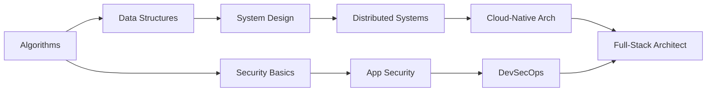

<!-- ═══════════════════════════════════════════════════════════════════ -->
<!--                          HERO SECTION                             -->
<!-- ═══════════════════════════════════════════════════════════════════ -->

<div align="center">


<p>
  
</p>

<p>
  <a href="https://github.com/yuanshikai168"></a>
  <a href="mailto:hello@example.com"></a>
  <a href="https://twitter.com/yourhandle"></a>
  <a href="https://linkedin.com/in/yourprofile"></a>
</p>

<p>
  
  
  
  
</p>

</div>

<br/>

<!-- ═══════════════════════════════════════════════════════════════════ -->
<!--                        BOOT SEQUENCE                              -->
<!-- ═══════════════════════════════════════════════════════════════════ -->

```
 ██╗  ██╗███████╗██╗   ██╗██████╗ ██╗   ██╗
 ██║  ██║██╔════╝██║   ██║██╔══██╗██║   ██║
 ███████║█████╗  ██║   ██║██████╔╝███████║
 ██╔══██║██╔══╝  ╚██╗ ██╔╝██╔══██╗██╔══██║
 ██║  ██║███████╗ ╚████╔╝ ██████╔╝██║  ██║
 ╚═╝  ╚═╝╚══════╝  ╚═══╝  ╚═════╝ ╚═╝  ╚═╝
```

```
╔══════════════════════════════════════════════════════════════════════════════╗
║  SYSTEM BOOT                                                                ║
╠══════════════════════════════════════════════════════════════════════════════╣
║                                                                              ║
║  BIOS CHECK  ──────  OK                                                      ║
║  MEMORY      ──────  128 GB ECC DDR5  ──────  OK                             ║
║  CPU         ──────  Full-Stack Engine v3.0  ──────  OK                      ║
║  SECURITY    ──────  Firewall ACTIVE / IDS ACTIVE  ──────  OK                ║
║  NETWORK     ──────  Cloud-Native Stack LOADED  ──────  OK                   ║
║  COFFEE      ──────  ☕☕☕☕☕ UNLIMITED  ──────  CRITICAL                     ║
║                                                                              ║
║  [███████████████████████████████████████████████████████] 100%               ║
║                                                                              ║
║  System ready. Loading profile...                                             ║
║                                                                              ║
║  yuanshikai168@github:~$  _                                                  ║
╚══════════════════════════════════════════════════════════════════════════════╝
```

<br/>

<!-- ═══════════════════════════════════════════════════════════════════ -->
<!--                      TERMINAL NAVIGATION                          -->
<!-- ═══════════════════════════════════════════════════════════════════ -->

```
╔══════════════════════════════════════════════════════════════════════════════╗
║  ~/profile $  ls -la                                                         ║
╠══════════════════════════════════════════════════════════════════════════════╣
║                                                                              ║
║  drwxr-xr-x  🎯 about/         System Dashboard & Bio                        ║
║  drwxr-xr-x  🛠️  skills/        Tech Stack & Proficiency                     ║
║  drwxr-xr-x  📂 projects/      Featured Work & Repos                         ║
║  drwxr-xr-x  🏆 awards/        Certifications & Achievements                 ║
║  drwxr-xr-x  🔥 now/           What I'm Working On                           ║
║  drwxr-xr-x  🚀 quickstart/    Clone & Run Guide                             ║
║  drwxr-xr-x  💻 code/          Sample Code Snippets                          ║
║  drwxr-xr-x  📊 stats/         GitHub Analytics                              ║
║  drwxr-xr-x  📝 blog/          Recent Articles                               ║
║  drwxr-xr-x  🖥️  setup/         Dev Environment                              ║
║  drwxr-xr-x  🤝 contribute/    Collaboration Guide                           ║
║  drwxr-xr-x  📬 contact/       Get In Touch                                  ║
║                                                                              ║
║  ~/profile $  _                                                              ║
╚══════════════════════════════════════════════════════════════════════════════╝
```

<br/>

<!-- ═══════════════════════════════════════════════════════════════════ -->
<!--                        ABOUT ME                                   -->
<!-- ═══════════════════════════════════════════════════════════════════ -->

<div align="center">


</div>

<table>
<tr>
<td width="48%" valign="top">

#### `systemctl status yuanshikai168`

```diff
● yuanshikai168.service — Full-Stack Engineer & Security Architect
     Loaded: loaded (/etc/passion/fullstack.conf)
     Active: active (running) since 2020
     Memory: unlimited (coffee-powered)

+ Tasks:
+   🏗️  Building resilient distributed systems
+   🔐  Embedding security into the SDLC
+   ☁️  Architecting cloud-native solutions
+   📖  Contributing to open source
+   🎓  Studying system design & algorithms

! Pending Upgrades:
!   Rust systems programming
!   eBPF kernel observability
!   Zero Trust architecture
```

</td>
<td width="52%" valign="top">

#### `cat ~/.config/identity.yml`

```yaml
# ═══════════════════════════════════════════
#  PERSONAL CONFIGURATION
# ═══════════════════════════════════════════

identity:
  name:   yuanshikai168
  role:   Full-Stack Engineer
  alias:  Security Architect
  base:   China
  edu:    Computer Science

environment:
  focus:  [Distributed, Security, Cloud]
  fuel:   coffee://unlimited
  ide:    [VS Code, Neovim]
  os:     [Linux, macOS]
  shell:  zsh + tmux
  theme:  Tokyo Night

expertise:
  ask_me:
    - Microservice architecture design
    - Application security hardening
    - CI/CD pipeline engineering
    - Cloud-native migration strategy
```

</td>
</tr>
</table>

> ```
> ┌─ Philosophy ─────────────────────────────────────────────────────────────┐
> │                                                                          │
> │  "Security is not an add-on — it's a design gene."                       │
> │                                                                          │
> │  Good Engineering = Clean Design                                         │
> │                  + Rigorous Security                                     │
> │                  + Reliable Operations                                   │
> │                                                                          │
> └──────────────────────────────────────────────────────────────────────────┘
> ```

<br/>

<!-- ═══════════════════════════════════════════════════════════════════ -->
<!--                        TECH STACK                                 -->
<!-- ═══════════════════════════════════════════════════════════════════ -->

<div align="center">


</div>

#### `>` Languages

<p align="center">
  
  
  
  
  
  
  
  
</p>

#### `>` Frameworks & Runtime

<p align="center">
  
  
  
  
  
  
  
  
</p>

#### `>` Data & Infrastructure

<p align="center">
  
  
  
  
</p>

<p align="center">
  
  
  
  
</p>

<p align="center">
  
  
  
</p>

#### `>` Security & Observability

<p align="center">
  
  
  
  
  
  
</p>

#### `>` Proficiency Scan

```
╔══════════════════════════════════════════════════════════════════════════════╗
║  SKILL PROFICIENCY MATRIX                                                    ║
╠══════════════════════════════════════════════════════════════════════════════╣
║                                                                              ║
║  Python       ████████████████████░░░░░░░░░░  95%  ██████  EXPERT           ║
║  JavaScript   ███████████████████░░░░░░░░░░░  90%  ██████  EXPERT           ║
║  SQL          ███████████████████░░░░░░░░░░░  90%  ██████  EXPERT           ║
║  TypeScript   ██████████████████░░░░░░░░░░░░  85%  █████░  ADVANCED         ║
║  Golang       ████████████████░░░░░░░░░░░░░░  80%  █████░  ADVANCED         ║
║  Shell        ██████████████░░░░░░░░░░░░░░░░  70%  ████░░  PROFICIENT       ║
║  Java         █████████████░░░░░░░░░░░░░░░░░  65%  ████░░  PROFICIENT       ║
║  Rust         ██████████░░░░░░░░░░░░░░░░░░░░  50%  ███░░░  INTERMEDIATE     ║
║                                                                              ║
╚══════════════════════════════════════════════════════════════════════════════╝
```

#### `>` Coding Activity

```
╔══════════════════════════════════════════════════════════════════════════════╗
║  WEEKLY CODING METRICS                                                       ║
╠══════════════════════════════════════════════════════════════════════════════╣
║                                                                              ║
║  Python     ████████████████████  52.3%   18h 24m                           ║
║  TypeScript █████████████░░░░░░░  24.1%    8h 30m                           ║
║  Go         ████████░░░░░░░░░░░░  12.7%    4h 28m                           ║
║  Shell      ███░░░░░░░░░░░░░░░░░   5.8%    2h 02m                           ║
║  Other      ██░░░░░░░░░░░░░░░░░░   5.1%    1h 47m                           ║
║                                                                              ║
║  Total: 35h 11m across 142 commits this week                                ║
╚══════════════════════════════════════════════════════════════════════════════╝
```

<br/>

<!-- ═══════════════════════════════════════════════════════════════════ -->
<!--                        PROJECTS                                   -->
<!-- ═══════════════════════════════════════════════════════════════════ -->

<div align="center">


</div>

<table>
  <tr>
    <td width="50%" valign="top">

```
╔══════════════════════════════════════════════════╗
║  🏗️ Awesome-Microservices              [ACTIVE]  ║
╠══════════════════════════════════════════════════╣
║                                                  ║
║  ▸ Service discovery & load balancing            ║
║  ▸ Circuit breaker & distributed tracing         ║
║  ▸ Docker Compose one-click deploy               ║
║                                                  ║
║  ┌─ Stack ───────────────────────────────────┐   ║
║  │  [Go] [Docker] [K8s] [gRPC]               │   ║
║  └───────────────────────────────────────────┘   ║
║                                                  ║
║  ⭐ 2.4k   🍴 380   📅 Updated 2 days ago       ║
║  >>> github.com/yuanshikai168/project1           ║
╚══════════════════════════════════════════════════╝
```

</td>
    <td width="50%" valign="top">

```
╔══════════════════════════════════════════════════╗
║  🔐 SecureAPI                          [ACTIVE]  ║
╠══════════════════════════════════════════════════╣
║                                                  ║
║  ▸ JWT + RBAC auth system                        ║
║  ▸ Rate limiting & input validation              ║
║  ▸ Auto security audit & OWASP compliance        ║
║                                                  ║
║  ┌─ Stack ───────────────────────────────────┐   ║
║  │  [Python] [FastAPI] [Redis] [JWT]          │   ║
║  └───────────────────────────────────────────┘   ║
║                                                  ║
║  ⭐ 1.8k   🍴 220   📅 Updated 5 days ago       ║
║  >>> github.com/yuanshikai168/project2           ║
╚══════════════════════════════════════════════════╝
```

</td>
  </tr>
  <tr>
    <td width="50%" valign="top">

```
╔══════════════════════════════════════════════════╗
║  ☁️ DevOps-Automation                  [ACTIVE]  ║
╠══════════════════════════════════════════════════╣
║                                                  ║
║  ▸ One-click AWS/Azure multi-region deploy       ║
║  ▸ Full CI/CD pipeline template library          ║
║  ▸ Monitoring alerts & cost optimization         ║
║                                                  ║
║  ┌─ Stack ───────────────────────────────────┐   ║
║  │  [Terraform] [AWS] [GH Actions] [K8s]      │   ║
║  └───────────────────────────────────────────┘   ║
║                                                  ║
║  ⭐ 3.1k   🍴 510   📅 Updated today            ║
║  >>> github.com/yuanshikai168/project3           ║
╚══════════════════════════════════════════════════╝
```

</td>
    <td width="50%" valign="top">

```
╔══════════════════════════════════════════════════╗
║  📊 Data Pipeline                      [BETA]    ║
╠══════════════════════════════════════════════════╣
║                                                  ║
║  ▸ Kafka streaming + Spark batch processing      ║
║  ▸ Automated ETL & data quality checks           ║
║  ▸ Grafana real-time monitoring dashboard        ║
║                                                  ║
║  ┌─ Stack ───────────────────────────────────┐   ║
║  │  [Python] [Kafka] [Spark] [Grafana]        │   ║
║  └───────────────────────────────────────────┘   ║
║                                                  ║
║  ⭐ 960    🍴 130   📅 Updated 1 week ago       ║
║  >>> github.com/yuanshikai168/project4           ║
╚══════════════════════════════════════════════════╝
```

</td>
  </tr>
</table>

<details>
<summary><b>📚 Learning Roadmap & Research Notes</b></summary>



| Domain | Content | Status |
|:---|:---|:---:|
| 🧮 Algorithms | LeetCode 300+ problems with solutions | ✅ Active |
| 🏛️ System Design | CAP / Paxos / Raft case studies | ✅ Active |
| 🔍 Security Research | CVE reproduction & web pentesting | 🔄 In Progress |
| ⚙️ DevOps | CI/CD · IaC · SRE patterns | 📝 Planned |
| 🦀 Rust | Systems programming: zero to concurrent | 🌱 Starting |

</details>

<br/>

<!-- ═══════════════════════════════════════════════════════════════════ -->
<!--                      CERTIFICATIONS                               -->
<!-- ═══════════════════════════════════════════════════════════════════ -->

<div align="center">


</div>

```
╔══════════════════════════════════════════════════════════════════════════════╗
║  CERTIFICATIONS & ACHIEVEMENTS                                               ║
╠══════════════════════════════════════════════════════════════════════════════╣
║                                                                              ║
║  [PASS]  ☁️  AWS Solutions Architect — Professional     Verified ✓           ║
║  [PASS]  ☸️  Kubernetes CKAD                             Verified ✓           ║
║  [PASS]  🐳  Docker Certified Associate (DCA)            Verified ✓           ║
║  [....]  🛡️  CEH (Certified Ethical Hacker)              In Progress          ║
║  [STAR]  ⭐  GitHub Star Contributor — 10+ projects      Awarded              ║
║  [WIN]   🏅  Hackathon Winner — 2025 Cloud Computing     1st Place 🏆        ║
║                                                                              ║
╚══════════════════════════════════════════════════════════════════════════════╝
```

<br/>

<!-- ═══════════════════════════════════════════════════════════════════ -->
<!--                        NOW SECTION                                -->
<!-- ═══════════════════════════════════════════════════════════════════ -->

<div align="center">


</div>

```
╔══════════════════════════════════════════════════════════════════════════════╗
║  CURRENTLY WORKING ON                                                       ║
╠══════════════════════════════════════════════════════════════════════════════╣
║                                                                              ║
║  🔥  Building a Rust-based CLI tool for infra provisioning                   ║
║      Progress: [████████████████░░░░] 80%                                    ║
║                                                                              ║
║  📖  Writing: "eBPF Observability for Cloud-Native Apps"                     ║
║      Progress: [██████░░░░░░░░░░░░░] 40%                                    ║
║                                                                              ║
║  🎯  Preparing for CKA (Certified Kubernetes Administrator)                  ║
║      Progress: [█████████████░░░░░░] 90%                                    ║
║                                                                              ║
║  🦀  Learning Rust — reading "The Book" chapter 18                           ║
║      Progress: [█████████░░░░░░░░░░] 55%                                    ║
║                                                                              ║
╠══════════════════════════════════════════════════════════════════════════════╣
║                                                                              ║
║  🎵  NOW PLAYING:                                                            ║
║      Spotify — Bohemian Rhapsody — Queen                                     ║
║      ░░░░░░░░░░░░░░▓▓▓▓▓▓▓▓▓▓░░░░░░░░░░░░░░░░░░░░░░░░░  2:34 / 5:55        ║
║                                                                              ║
╚══════════════════════════════════════════════════════════════════════════════╝
```

<p align="center">
  <a href="https://open.spotify.com/user/youruser">
    
  </a>
</p>

<br/>

<!-- ═══════════════════════════════════════════════════════════════════ -->
<!--                       QUICK START                                 -->
<!-- ═══════════════════════════════════════════════════════════════════ -->

<div align="center">


</div>

#### `>` Prerequisites

```
╔══════════════════════════════════════════════════════════════════════════════╗
║  PREREQUISITES                                                               ║
╠══════════════════╦══════════════╦════════════════════════════════════════════╣
║  Tool            ║  Version     ║  Purpose                                   ║
╠══════════════════╬══════════════╬════════════════════════════════════════════╣
║  Python          ║  >= 3.10     ║  Backend runtime                           ║
║  Node.js         ║  >= 18.0     ║  Frontend runtime                          ║
║  Docker          ║  >= 24.0     ║  Containerization (optional)               ║
║  Go              ║  >= 1.21     ║  Go compilation (optional)                 ║
╚══════════════════╩══════════════╩════════════════════════════════════════════╝
```

#### `>` Clone & Launch

```bash
# ─── Clone ────────────────────────────────────
git clone https://github.com/yuanshikai168/yuanshikai168.git
cd yuanshikai168

# ─── Launch ───────────────────────────────────
# Linux / macOS
chmod +x start.sh && ./start.sh

# Windows (PowerShell / Git Bash)
bash start.sh
```

<details>
<summary><b>📦 Manual Setup</b></summary>

```bash
# ── Python ──
pip install -r requirements.txt
python app.py

# ── Node.js ──
npm install
npm start

# ── Go ──
go mod download
go run main.go
```

</details>

<details>
<summary><b>🐳 Docker</b></summary>

```bash
docker build -t yuanshikai168 .
docker run -d -p 8000:8000 --name app yuanshikai168

# docker-compose (with DB + cache)
docker-compose up -d
```

</details>

<details>
<summary><b>🧪 Testing</b></summary>

```bash
pytest tests/ -v --cov=src --cov-report=html   # Python
npm test -- --coverage                           # JS/TS
./start.sh test                                  # Via script
```

</details>

<details>
<summary><b>📋 start.sh Commands</b></summary>

```
╔════════════════════════════╦═════════════════════════════════════════════════╗
║  Command                   ║  Description                                    ║
╠════════════════════════════╬═════════════════════════════════════════════════╣
║  ./start.sh                ║  Auto-detect & launch (default)                 ║
║  ./start.sh deps           ║  Install dependencies only                      ║
║  ./start.sh docker         ║  Start Docker containers                        ║
║  ./start.sh migrate        ║  Run database migrations                        ║
║  ./start.sh test           ║  Run test suites                                ║
║  ./start.sh clean          ║  Clean caches & temp files                      ║
║  ./start.sh help           ║  Show help                                      ║
╚════════════════════════════╩═════════════════════════════════════════════════╝
```

</details>

#### `>` Repo Structure

```
yuanshikai168/
├── .github/workflows/
│   └── ci.yml                # CI/CD pipeline config
├── assets/                   # Static resources
├── CONTRIBUTING.md           # Contribution guide
├── README.md                 # You are here ✨
├── package.json-example      # Node.js deps example
├── requirements-example.txt  # Python deps example
└── start.sh                  # One-click launcher
```

<br/>

<!-- ═══════════════════════════════════════════════════════════════════ -->
<!--                       CODE SAMPLES                                -->
<!-- ═══════════════════════════════════════════════════════════════════ -->

<div align="center">


</div>

<details>
<summary><b>🐍 Python — Async API (FastAPI + Connection Pool)</b></summary>

```python
from fastapi import FastAPI, Depends, HTTPException, status
from fastapi.security import HTTPBearer
from contextlib import asynccontextmanager
from sqlalchemy.ext.asyncio import create_async_engine

engine = create_async_engine("postgresql+asyncpg://localhost/app", pool_size=20)

@asynccontextmanager
async def lifespan(app: FastAPI):
    await init_db_pool(engine)
    await init_redis_cache("redis://localhost:6379")
    yield
    await engine.dispose()

app = FastAPI(title="Secure API", version="1.0.0", lifespan=lifespan)
security = HTTPBearer()

@app.get("/api/v1/data")
async def get_data(credentials=Depends(security)):
    try:
        result = await fetch_from_db(engine)
        return {"status": "success", "data": result, "count": len(result)}
    except Exception as e:
        raise HTTPException(
            status_code=status.HTTP_500_INTERNAL_SERVER_ERROR,
            detail=str(e),
        )
```

</details>

<details>
<summary><b>⚛️ React — Dashboard (Hooks + Error Boundary)</b></summary>

```jsx
import React, { useState, useEffect, useCallback } from 'react';
import axios from 'axios';

export const Dashboard = () => {
  const [data, setData] = useState([]);
  const [loading, setLoading] = useState(true);
  const [error, setError] = useState(null);

  const fetchData = useCallback(async () => {
    setLoading(true);
    setError(null);
    try {
      const { data: res } = await axios.get('/api/v1/data', {
        headers: { Authorization: `Bearer ${getToken()}` },
      });
      setData(res.data);
    } catch (err) {
      setError(err.response?.data?.detail ?? 'Load failed');
    } finally {
      setLoading(false);
    }
  }, []);

  useEffect(() => { fetchData(); }, [fetchData]);

  if (loading) return <Skeleton rows={5} />;
  if (error)   return <ErrorAlert message={error} onRetry={fetchData} />;

  return (
    <section className="dashboard">
      <h2>Dashboard</h2>
      <ul className="card-grid">
        {data.map(item => (
          <li key={item.id} className="card">{item.name}</li>
        ))}
      </ul>
    </section>
  );
};
```

</details>

<details>
<summary><b>🔵 Go — Concurrent HTTP Fetcher (Worker Pool)</b></summary>

```go
package main

import (
    "fmt"
    "net/http"
    "sync"
    "time"
)

func FetchConcurrently(urls []string, workers int) map[string]string {
    results := make(map[string]string)
    var mu sync.Mutex
    var wg sync.WaitGroup
    sem := make(chan struct{}, workers)
    client := &http.Client{Timeout: 5 * time.Second}

    for _, url := range urls {
        wg.Add(1)
        go func(u string) {
            defer wg.Done()
            sem <- struct{}{}
            defer func() { <-sem }()

            resp, err := client.Get(u)
            if err == nil {
                defer resp.Body.Close()
                mu.Lock()
                results[u] = resp.Status
                mu.Unlock()
            }
        }(url)
    }
    wg.Wait()
    return results
}

func main() {
    urls := []string{"https://example.com", "https://httpbin.org/get"}
    for url, status := range FetchConcurrently(urls, 5) {
        fmt.Printf("%-30s -> %s\n", url, status)
    }
}
```

</details>

<br/>

<!-- ═══════════════════════════════════════════════════════════════════ -->
<!--                       GITHUB STATS                                -->
<!-- ═══════════════════════════════════════════════════════════════════ -->

<div align="center">


</div>

<p align="center">
  
  
</p>

<p align="center">
  
</p>

<p align="center">
  
</p>

#### `>` Contribution Heatmap

<p align="center">
  
</p>

#### `>` Recent Activity

<p align="center">
  
</p>

#### `>` Snake Eats My Contributions

<p align="center">
  
</p>

<br/>

<!-- ═══════════════════════════════════════════════════════════════════ -->
<!--                      RECENT BLOG POSTS                            -->
<!-- ═══════════════════════════════════════════════════════════════════ -->

<div align="center">


</div>

```
╔══════════════════════════════════════════════════════════════════════════════╗
║  RECENT ARTICLES                                                             ║
╠══════════════════════════════════════════════════════════════════════════════╣
║                                                                              ║
║  📄  [2026-05-18]  Building Resilient Microservices with Go                  ║
║       用 Go 构建高韧性微服务                                                 ║
║       #microservices #go #resilience #distributed-systems                    ║
║                                                                              ║
║  📄  [2026-05-05]  Zero Trust Architecture: A Practical Guide               ║
║       零信任架构实战指南                                                     ║
║       #security #zero-trust #architecture #best-practices                    ║
║                                                                              ║
║  📄  [2026-04-22]  Kubernetes Cost Optimization: Save 40% on Cloud Bills     ║
║       K8s 成本优化：省下 40% 云账单                                          ║
║       #kubernetes #cloud #cost-optimization #devops                          ║
║                                                                              ║
║  📄  [2026-04-10]  From Monolith to Microservices: Migration Playbook       ║
║       从单体到微服务：迁移实战手册                                           ║
║       #migration #architecture #refactoring #case-study                      ║
║                                                                              ║
║  >>> More articles at blog.yuanshikai168.dev                                 ║
╚══════════════════════════════════════════════════════════════════════════════╝
```

<br/>

<!-- ═══════════════════════════════════════════════════════════════════ -->
<!--                       DEV SETUP                                   -->
<!-- ═══════════════════════════════════════════════════════════════════ -->

<div align="center">


</div>

<table>
<tr>
<td width="50%" valign="top">

#### `neofetch`

```
       _,met$$$$$gg.           yuanshikai168@devstation
    ,g$$$$$$$$$$$$$$$P.       ──────────────────────────
  ,g$$P"     """Y$$.".        OS:      Arch Linux x86_64
 ,$$P'              `$$$.      Kernel:  6.7.0-zen
',$$P       ,ggs.     `$$b:    Shell:   zsh 5.9
`d$$'     ,$P"'   .    $$$     Editor:  Neovim / VS Code
 $$P      d$'     ,    $$P     Terminal: Alacritty + tmux
 $$:      $$.   -    ,d$$'     Theme:   Tokyo Night
 $$;      Y$b._   _,d$P'       Font:    JetBrains Mono NF
 Y$$.    `.`"Y$$$$P"'          CPU:     AMD Ryzen 9 7950X
 `$$b      "-.__               GPU:     NVIDIA RTX 4090
  `Y$$                         RAM:     64 GB DDR5
   `Y$$.                       Disk:    2 TB NVMe SSD
     `$$b.                     Uptime:  ∞ (coffee-powered)
       `Y$$b.
          `"Y$b._
              `"""
```

</td>
<td width="50%" valign="top">

#### `cat ~/.config/tools.json`

```json
{
  "terminal": {
    "emulator":    "Alacritty",
    "multiplexer": "tmux",
    "shell":       "zsh + starship"
  },
  "editor": {
    "primary":     "Neovim + LazyVim",
    "secondary":   "VS Code",
    "font":        "JetBrains Mono NF",
    "theme":       "Tokyo Night"
  },
  "productivity": {
    "notes":       "Obsidian",
    "diagrams":    "Excalidraw",
    "api_test":    "HTTPie + Bruno",
    "db_client":   "DBeaver"
  },
  "devops": {
    "ci_cd":       "GitHub Actions",
    "iac":         "Terraform + Pulumi",
    "monitoring":  "Grafana Stack",
    "containers":  "Docker + Podman"
  },
  "hardware": {
    "keyboard":    "Keychron Q1 Pro",
    "mouse":       "Logitech MX Master 3S",
    "monitor":     "LG 32UN880 4K"
  }
}
```

</td>
</tr>
</table>

<br/>

<!-- ═══════════════════════════════════════════════════════════════════ -->
<!--                      CONTRIBUTING                                 -->
<!-- ═══════════════════════════════════════════════════════════════════ -->

<div align="center">


</div>

```
╔══════════════════════════════════════════════════════════════════════════════╗
║  CONTRIBUTION WORKFLOW                                                       ║
╠══════════════════════════════════════════════════════════════════════════════╣
║                                                                              ║
║  Fork ──▶ Clone ──▶ Branch ──▶ Code ──▶ Test ──▶ Commit ──▶ Push ──▶ PR   ║
║                                                                              ║
╠══════════════════════════════════════════════════════════════════════════════╣
║                                                                              ║
║  Branch Naming:   feature/xxx · fix/xxx · docs/xxx · refactor/xxx           ║
║  Commit Format:   Conventional Commits (feat/fix/docs/style/refactor/...)   ║
║  PR Requirements: CI pass + >= 1 approval + coverage >= 80%                 ║
║                                                                              ║
║  Full guide: CONTRIBUTING.md                                                 ║
╚══════════════════════════════════════════════════════════════════════════════╝
```

<br/>

<!-- ═══════════════════════════════════════════════════════════════════ -->
<!--                      CI / CD PIPELINE                             -->
<!-- ═══════════════════════════════════════════════════════════════════ -->

<div align="center">


</div>

```
  Push / PR
     │
     ▼
  ╔══════════════╗     ╔══════════════╗     ╔══════════════╗
  ║  🔍 LINT     ║────▶║  🧪 TEST     ║────▶║  📊 QUAL     ║
  ║ Super-Linter ║     ║ pytest/jest  ║     ║  SonarQube   ║
  ╚══════════════╝     ╚══════════════╝     ╚══════════════╝
                                                  │
                                                  ▼
  ╔══════════════╗     ╔══════════════╗     ╔══════════════╗
  ║  ✅ DEPLOY   ║◀────║  🐳 BUILD    ║◀────║  🛡️  SEC     ║
  ║   Release    ║     ║   Docker     ║     ║ Trivy+OWASP  ║
  ╚══════════════╝     ╚══════════════╝     ╚══════════════╝
```

> Config: [.github/workflows/ci.yml](.github/workflows/ci.yml)

<br/>

<!-- ═══════════════════════════════════════════════════════════════════ -->
<!--                        CONTACT                                    -->
<!-- ═══════════════════════════════════════════════════════════════════ -->

<div align="center">


</div>

```
╔══════════════════════════════════════════════════════════════════════════════╗
║  ESTABLISHING CONNECTION...                                                  ║
╠══════════════════════════════════════════════════════════════════════════════╣
║                                                                              ║
║  📧  Email       hello@example.com                                           ║
║  🐙  GitHub      github.com/yuanshikai168                                    ║
║  💼  LinkedIn    linkedin.com/in/yourprofile                                 ║
║  🐦  Twitter     twitter.com/yourhandle                                      ║
║  🐛  Issues      github.com/yuanshikai168/yuanshikai168/issues              ║
║  💬  Discuss     github.com/yuanshikai168/yuanshikai168/discussions          ║
║                                                                              ║
║  Connection established. Awaiting input...                                    ║
║                                                                              ║
║  yuanshikai168@github:~$  _                                                  ║
╚══════════════════════════════════════════════════════════════════════════════╝
```

<p align="center">
  <a href="mailto:hello@example.com"></a>
  <a href="https://github.com/yuanshikai168"></a>
  <a href="https://linkedin.com/in/yourprofile"></a>
  <a href="https://twitter.com/yourhandle"></a>
</p>

<br/>

<!-- ═══════════════════════════════════════════════════════════════════ -->
<!--                        QUOTES                                     -->
<!-- ═══════════════════════════════════════════════════════════════════ -->

<div align="center">

```
╔══════════════════════════════════════════════════════════════════════════════╗
║                                                                              ║
║   "There are only two hard things in Computer Science:                       ║
║    cache invalidation and naming things."                                    ║
║                                                                              ║
║                                            — Phil Karlton                   ║
║                                                                              ║
╚══════════════════════════════════════════════════════════════════════════════╝
```

<details>
<summary><b>💬 More quotes</b></summary>

> *"First, solve the problem. Then, write the code."* — John Johnson

> *"Security is not a product, but a process."* — Bruce Schneier

> *"Any fool can write code that a computer can understand. Good programmers write code that humans can understand."* — Martin Fowler

> *"The best error message is the one that never shows up."* — Thomas Fuchs

> *"Talk is cheap. Show me the code."* — Linus Torvalds

</details>

</div>

<br/>

<!-- ═══════════════════════════════════════════════════════════════════ -->
<!--                         FOOTER                                    -->
<!-- ═══════════════════════════════════════════════════════════════════ -->

<div align="center">


<p>
  <a href="https://github.com/yuanshikai168/yuanshikai168/stargazers">
    
  </a>
  <a href="https://github.com/yuanshikai168/yuanshikai168/network/members">
    
  </a>
  
</p>

```
╔══════════════════════════════════════════════════╗
║                                                  ║
║   If this profile inspired you, drop a ⭐ !      ║
║   Fork it, remix it, make it your own.           ║
║                                                  ║
╚══════════════════════════════════════════════════╝
```

<p>
  <a href="#"><b>⬆ Back to Top</b></a>
</p>

</div>
