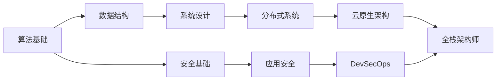

<!-- ═══════════════════════════════════════════════════════════ -->
<!--                     HERO SECTION                          -->
<!-- ═══════════════════════════════════════════════════════════ -->

<div align="center">


<p>
  
</p>

<p>
  <a href="https://github.com/yuanshikai168"></a>
  <a href="mailto:hello@example.com"></a>
  <a href="https://twitter.com/yourhandle"></a>
  <a href="https://linkedin.com/in/yourprofile"></a>
</p>

<p>
  
  
  
</p>

</div>

<br/>

<!-- ═══════════════════════════════════════════════════════════ -->
<!--                    TERMINAL NAV                           -->
<!-- ═══════════════════════════════════════════════════════════ -->

```bash
┌──────────────────────────────────────────────────────────────────┐
│  yuanshikai168@github:~$  ./navigate.sh                          │
├──────────────────────────────────────────────────────────────────┤
│                                                                  │
│  [1] 🎯 About       [2] 🛠️ Skills       [3] 📂 Projects         │
│  [4] 🏆 Awards      [5] 🚀 Quick Start  [6] 💻 Code             │
│  [7] 📊 Stats       [8] 🤝 Contribute   [9] 📬 Contact          │
│                                                                  │
│  yuanshikai168@github:~$  _                                      │
└──────────────────────────────────────────────────────────────────┘
```

<br/>

<!-- ═══════════════════════════════════════════════════════════ -->
<!--                     ABOUT ME                              -->
<!-- ═══════════════════════════════════════════════════════════ -->

<div align="center">


</div>

<table>
<tr>
<td width="50%" valign="top">

#### `>` 当前任务

```diff
+ 🏗️ 设计与构建高可用分布式系统
+ 🔐 推动安全左移，安全融入开发全流程
+ ☁️ 云原生应用与 DevSecOps 自动化
+ 📖 开源社区贡献 & 技术分享
+ 🎓 系统设计 & 算法优化
```

#### `>` 正在加载

```diff
! Rust 系统编程与高性能并发
! eBPF 内核级可观测性
! Zero Trust 安全架构
```

</td>
<td width="50%" valign="top">

#### `~/.config/profile`

```yaml
╭──────────────────────────────╮
│  role:    Full-Stack / Security Architect  │
│  base:    China                            │
│  edu:     Computer Science                 │
│  focus:   Distributed · Security · Cloud   │
│  fuel:    ☕☕☕☕☕ (unlimited)              │
│  ide:     VS Code / Neovim                │
│  os:      Linux / macOS                    │
│  shell:   zsh + tmux                      │
╰──────────────────────────────╯
```

#### `>` Ask me about

- 微服务架构设计
- 应用安全加固
- CI/CD 流水线
- 云原生迁移策略

</td>
</tr>
</table>

> ```
> "Security is not an add-on, it's a design gene."
> Good engineering = Clean Design + Rigorous Security + Reliable Ops
> ```

<br/>

<!-- ═══════════════════════════════════════════════════════════ -->
<!--                      SKILLS                               -->
<!-- ═══════════════════════════════════════════════════════════ -->

<div align="center">


</div>

#### `>` Languages

<p align="center">
  
  
  
  
  
  
  
  
</p>

#### `>` Frameworks & Runtime

<p align="center">
  
  
  
  
  
  
  
  
</p>

#### `>` Data & Infrastructure

<p align="center">
  
  
  
  
</p>

<p align="center">
  
  
  
  
</p>

<p align="center">
  
  
  
</p>

#### `>` Security & Observability

<p align="center">
  
  
  
  
  
  
</p>

#### `>` Proficiency Matrix

```
╔══════════════════════════════════════════════════════════╗
║  Python       ████████████████████░░░░░░░░░░  95%       ║
║  JavaScript   ███████████████████░░░░░░░░░░░  90%       ║
║  SQL          ███████████████████░░░░░░░░░░░  90%       ║
║  TypeScript   ██████████████████░░░░░░░░░░░░  85%       ║
║  Golang       ████████████████░░░░░░░░░░░░░░  80%       ║
║  Shell        ██████████████░░░░░░░░░░░░░░░░  70%       ║
║  Java         █████████████░░░░░░░░░░░░░░░░░  65%       ║
║  Rust         ██████████░░░░░░░░░░░░░░░░░░░░  50%       ║
╚══════════════════════════════════════════════════════════╝
```

<br/>

<!-- ═══════════════════════════════════════════════════════════ -->
<!--                     PROJECTS                              -->
<!-- ═══════════════════════════════════════════════════════════ -->

<div align="center">


</div>

<table>
  <tr>
    <td width="50%" valign="top">

```
╔══════════════════════════════════════╗
║  🏗️ Awesome-Microservices           ║
╠══════════════════════════════════════╣
║  ▸ 服务发现 · 负载均衡 · 熔断器      ║
║  ▸ 分布式链路追踪与日志聚合           ║
║  ▸ Docker Compose 一键部署            ║
╠══════════════════════════════════════╣
║  [Go] [Docker] [K8s]                 ║
║  >>> github.com/yuanshikai168/p1     ║
╚══════════════════════════════════════╝
```

</td>
    <td width="50%" valign="top">

```
╔══════════════════════════════════════╗
║  🔐 SecureAPI                        ║
╠══════════════════════════════════════╣
║  ▸ JWT + RBAC 认证授权体系           ║
║  ▸ 速率限制与输入验证中间件           ║
║  ▸ 自动化安全审计 & OWASP 合规       ║
╠══════════════════════════════════════╣
║  [Python] [FastAPI] [Redis]          ║
║  >>> github.com/yuanshikai168/p2     ║
╚══════════════════════════════════════╝
```

</td>
  </tr>
  <tr>
    <td width="50%" valign="top">

```
╔══════════════════════════════════════╗
║  ☁️ DevOps-Automation                ║
╠══════════════════════════════════════╣
║  ▸ 一键部署 AWS/Azure 多区域环境     ║
║  ▸ 完整 CI/CD 流水线模板库           ║
║  ▸ 监控告警 & 成本优化看板            ║
╠══════════════════════════════════════╣
║  [Terraform] [AWS] [GH Actions]      ║
║  >>> github.com/yuanshikai168/p3     ║
╚══════════════════════════════════════╝
```

</td>
    <td width="50%" valign="top">

```
╔══════════════════════════════════════╗
║  📊 Data Pipeline                    ║
╠══════════════════════════════════════╣
║  ▸ Kafka 流式计算 + Spark 批处理     ║
║  ▸ 自动化 ETL 与数据质量校验         ║
║  ▸ Grafana 可视化监控看板             ║
╠══════════════════════════════════════╣
║  [Python] [Kafka] [Spark]            ║
║  >>> github.com/yuanshikai168/p4     ║
╚══════════════════════════════════════╝
```

</td>
  </tr>
</table>

<details>
<summary><b>📚 学习路线图 & 研究笔记</b></summary>



| 领域 | 内容 | 状态 |
|:---|:---|:---:|
| 🧮 算法 | LeetCode 300+ 题详解 | ✅ |
| 🏛️ 系统设计 | CAP / Paxos / Raft 案例 | ✅ |
| 🔍 安全研究 | CVE 复现 · Web 攻防 | 🔄 |
| ⚙️ DevOps | CI/CD · IaC · SRE | 📝 |
| 🦀 Rust | 从零到高性能并发 | 🌱 |

</details>

<br/>

<!-- ═══════════════════════════════════════════════════════════ -->
<!--                      AWARDS                               -->
<!-- ═══════════════════════════════════════════════════════════ -->

<div align="center">


</div>

```
┌─────────────────────────────────────────────────────────────────────┐
│                                                                     │
│  ☁️  AWS Solutions Architect — Professional      ✅ Obtained        │
│  ☸️  Kubernetes CKAD                              ✅ Obtained        │
│  🐳  Docker Certified Associate (DCA)             ✅ Obtained        │
│  🛡️  CEH (Certified Ethical Hacker)               🔄 In Progress     │
│  ⭐  GitHub Star Contributor (10+ projects)       🎖️                 │
│  🏅  Hackathon Winner — 2025 Cloud Computing     🏆                 │
│                                                                     │
└─────────────────────────────────────────────────────────────────────┘
```

<br/>

<!-- ═══════════════════════════════════════════════════════════ -->
<!--                    QUICK START                            -->
<!-- ═══════════════════════════════════════════════════════════ -->

<div align="center">


</div>

#### `>` Prerequisites

| Tool | Version | Purpose |
|:---|:---:|:---|
| Python | `≥ 3.10` | Backend runtime |
| Node.js | `≥ 18.0` | Frontend runtime |
| Docker | `≥ 24.0` | Containerization _(optional)_ |
| Go | `≥ 1.21` | Go compilation _(optional)_ |

#### `>` Clone & Run

```bash
# ─── Clone ────────────────────────────────────
git clone https://github.com/yuanshikai168/yuanshikai168.git
cd yuanshikai168

# ─── Launch ───────────────────────────────────
# Linux / macOS
chmod +x start.sh && ./start.sh

# Windows (PowerShell / Git Bash)
bash start.sh
```

<details>
<summary><b>📦 Manual Setup</b></summary>

```bash
# ── Python ──
pip install -r requirements.txt
python app.py

# ── Node.js ──
npm install
npm start

# ── Go ──
go mod download
go run main.go
```

</details>

<details>
<summary><b>🐳 Docker</b></summary>

```bash
docker build -t yuanshikai168 .
docker run -d -p 8000:8000 --name app yuanshikai168

# docker-compose (with DB + cache)
docker-compose up -d
```

</details>

<details>
<summary><b>🧪 Testing</b></summary>

```bash
pytest tests/ -v --cov=src --cov-report=html   # Python
npm test -- --coverage                           # JS/TS
./start.sh test                                  # Via script
```

</details>

<details>
<summary><b>📋 start.sh Commands</b></summary>

| Command | Description |
|:---|:---|
| `./start.sh` | Auto-detect & launch _(default)_ |
| `./start.sh deps` | Install dependencies only |
| `./start.sh docker` | Start Docker containers |
| `./start.sh migrate` | Run database migrations |
| `./start.sh test` | Run test suites |
| `./start.sh clean` | Clean caches & temp files |
| `./start.sh help` | Show help |

</details>

#### `>` Repo Structure

```
yuanshikai168/
├── .github/workflows/
│   └── ci.yml                # CI/CD pipeline
├── assets/                   # Static resources
├── CONTRIBUTING.md           # Contribution guide
├── README.md                 # You are here ✨
├── package.json-example      # Node.js deps example
├── requirements-example.txt  # Python deps example
└── start.sh                  # One-click launcher
```

<br/>

<!-- ═══════════════════════════════════════════════════════════ -->
<!--                    CODE SAMPLES                           -->
<!-- ═══════════════════════════════════════════════════════════ -->

<div align="center">


</div>

<details>
<summary><b>🐍 Python — Async API (FastAPI + Connection Pool)</b></summary>

```python
from fastapi import FastAPI, Depends, HTTPException, status
from fastapi.security import HTTPBearer
from contextlib import asynccontextmanager
from sqlalchemy.ext.asyncio import create_async_engine

engine = create_async_engine("postgresql+asyncpg://localhost/app", pool_size=20)

@asynccontextmanager
async def lifespan(app: FastAPI):
    await init_db_pool(engine)
    await init_redis_cache("redis://localhost:6379")
    yield
    await engine.dispose()

app = FastAPI(title="Secure API", version="1.0.0", lifespan=lifespan)
security = HTTPBearer()

@app.get("/api/v1/data")
async def get_data(credentials=Depends(security)):
    try:
        result = await fetch_from_db(engine)
        return {"status": "success", "data": result, "count": len(result)}
    except Exception as e:
        raise HTTPException(
            status_code=status.HTTP_500_INTERNAL_SERVER_ERROR,
            detail=str(e),
        )
```

</details>

<details>
<summary><b>⚛️ React — Dashboard (Hooks + Error Boundary)</b></summary>

```jsx
import React, { useState, useEffect, useCallback } from 'react';
import axios from 'axios';

export const Dashboard = () => {
  const [data, setData] = useState([]);
  const [loading, setLoading] = useState(true);
  const [error, setError] = useState(null);

  const fetchData = useCallback(async () => {
    setLoading(true);
    setError(null);
    try {
      const { data: res } = await axios.get('/api/v1/data', {
        headers: { Authorization: `Bearer ${getToken()}` },
      });
      setData(res.data);
    } catch (err) {
      setError(err.response?.data?.detail ?? 'Load failed');
    } finally {
      setLoading(false);
    }
  }, []);

  useEffect(() => { fetchData(); }, [fetchData]);

  if (loading) return <Skeleton rows={5} />;
  if (error)   return <ErrorAlert message={error} onRetry={fetchData} />;

  return (
    <section className="dashboard">
      <h2>Dashboard</h2>
      <ul className="card-grid">
        {data.map(item => (
          <li key={item.id} className="card">{item.name}</li>
        ))}
      </ul>
    </section>
  );
};
```

</details>

<details>
<summary><b>🔵 Go — Concurrent HTTP Fetcher (Worker Pool)</b></summary>

```go
package main

import (
    "fmt"
    "net/http"
    "sync"
    "time"
)

func FetchConcurrently(urls []string, workers int) map[string]string {
    results := make(map[string]string)
    var mu sync.Mutex
    var wg sync.WaitGroup
    sem := make(chan struct{}, workers)
    client := &http.Client{Timeout: 5 * time.Second}

    for _, url := range urls {
        wg.Add(1)
        go func(u string) {
            defer wg.Done()
            sem <- struct{}{}
            defer func() { <-sem }()

            resp, err := client.Get(u)
            if err == nil {
                defer resp.Body.Close()
                mu.Lock()
                results[u] = resp.Status
                mu.Unlock()
            }
        }(url)
    }
    wg.Wait()
    return results
}

func main() {
    urls := []string{"https://example.com", "https://httpbin.org/get"}
    for url, status := range FetchConcurrently(urls, 5) {
        fmt.Printf("%-30s -> %s\n", url, status)
    }
}
```

</details>

<br/>

<!-- ═══════════════════════════════════════════════════════════ -->
<!--                   GITHUB STATS                            -->
<!-- ═══════════════════════════════════════════════════════════ -->

<div align="center">


</div>

<p align="center">
  
  
</p>

<p align="center">
  
</p>

<p align="center">
  
</p>

<p align="center">
  
</p>

<br/>

<!-- ═══════════════════════════════════════════════════════════ -->
<!--                    CONTRIBUTING                           -->
<!-- ═══════════════════════════════════════════════════════════ -->

<div align="center">


</div>

```
Fork → Clone → Branch → Code → Test → Commit → Push → PR
```

| Convention | Format |
|:---|:---|
| **Branches** | `feature/xxx` · `fix/xxx` · `docs/xxx` · `refactor/xxx` |
| **Commits** | Conventional Commits — `feat` `fix` `docs` `style` `refactor` `perf` `test` `chore` |
| **PR Review** | CI pass + ≥1 maintainer approval + test coverage ≥ 80% |

> Full details: [CONTRIBUTING.md](CONTRIBUTING.md)

<br/>

<!-- ═══════════════════════════════════════════════════════════ -->
<!--                    CI / CD PIPELINE                       -->
<!-- ═══════════════════════════════════════════════════════════ -->

<div align="center">


</div>

```
Push / PR
   │
   ▼
┌──────────┐    ┌──────────┐    ┌──────────┐    ┌──────────┐    ┌──────────┐
│ 🔍 Lint  │───▶│ 🧪 Test  │───▶│ 📊 Qual  │───▶│ 🛡️ Sec   │───▶│ 🐳 Build │
│ Super-   │    │ pytest   │    │SonarQube │    │Trivy +   │    │ Docker   │
│ Linter   │    │ jest     │    │          │    │ OWASP    │    │          │
└──────────┘    └──────────┘    └──────────┘    └──────────┘    └──────────┘
```

> Config: [.github/workflows/ci.yml](.github/workflows/ci.yml)

<br/>

<!-- ═══════════════════════════════════════════════════════════ -->
<!--                     CONTACT                               -->
<!-- ═══════════════════════════════════════════════════════════ -->

<div align="center">


</div>

<p align="center">
  <a href="mailto:hello@example.com"></a>
  <a href="https://github.com/yuanshikai168"></a>
</p>
<p align="center">
  <a href="https://linkedin.com/in/yourprofile"></a>
  <a href="https://twitter.com/yourhandle"></a>
</p>

<p align="center">
  <a href="https://github.com/yuanshikai168/yuanshikai168/issues">🐛 Report Bug</a>
  &nbsp;·&nbsp;
  <a href="https://github.com/yuanshikai168/yuanshikai168/discussions">💬 Discussions</a>
</p>

<br/>

<!-- ═══════════════════════════════════════════════════════════ -->
<!--                      QUOTES                               -->
<!-- ═══════════════════════════════════════════════════════════ -->

<div align="center">

```
┌──────────────────────────────────────────────────────────────────────┐
│                                                                      │
│  "There are only two hard things in Computer Science:                │
│   cache invalidation and naming things."                             │
│                                                    — Phil Karlton    │
│                                                                      │
└──────────────────────────────────────────────────────────────────────┘
```

<details>
<summary><b>More quotes</b></summary>

> *"First, solve the problem. Then, write the code."* — John Johnson

> *"Security is not a product, but a process."* — Bruce Schneier

> *"Any fool can write code that a computer can understand. Good programmers write code that humans can understand."* — Martin Fowler

</details>

</div>

<br/>

<!-- ═══════════════════════════════════════════════════════════ -->
<!--                      FOOTER                               -->
<!-- ═══════════════════════════════════════════════════════════ -->

<div align="center">


<p>
  <a href="https://github.com/yuanshikai168/yuanshikai168/stargazers">
    
  </a>
  <a href="https://github.com/yuanshikai168/yuanshikai168/network/members">
    
  </a>
  
</p>

<p>
  <a href="#"><b>⬆️ Back to Top</b></a>
</p>

</div>
